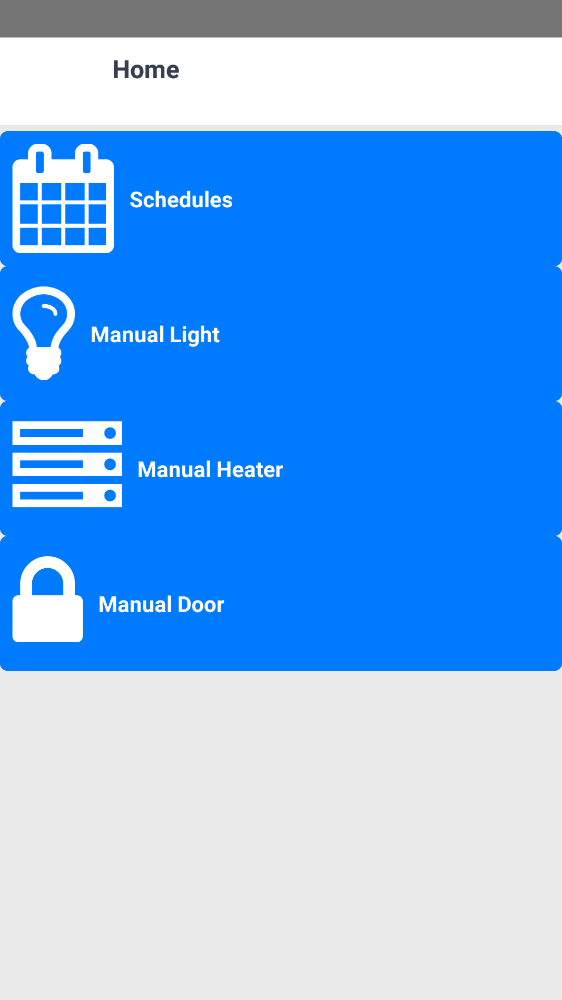
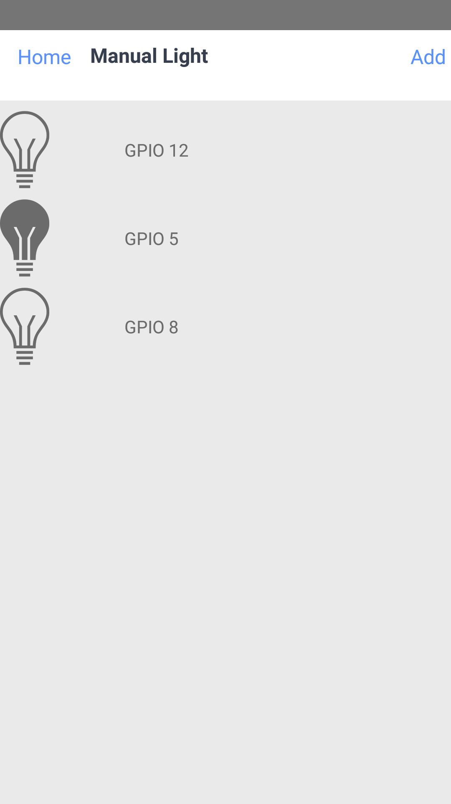
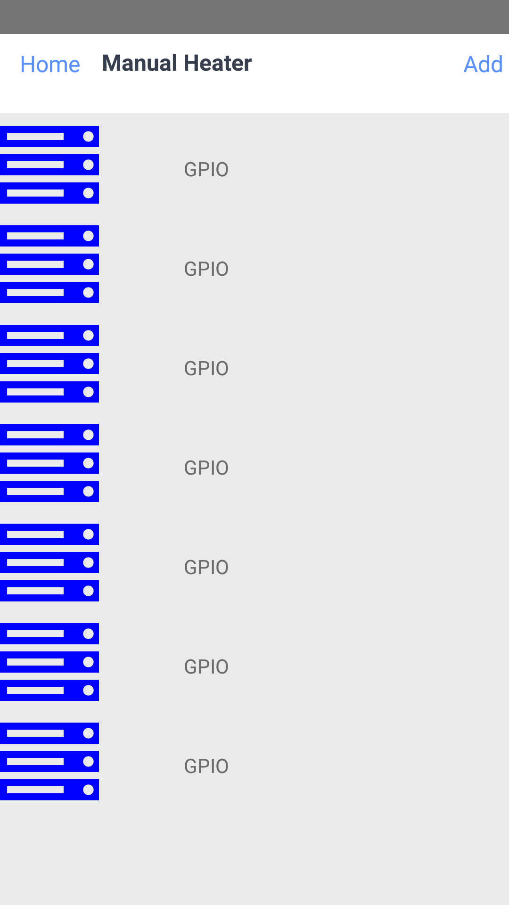

# Domotic

Une application de domotique simple, permettant depuis un smartphone de
controller des lampes, un chauffage et des portes.

## Installation

### Server

```
git clone https://github.com/poupitoo/domotique
cd domotique/server
pip install -r requirements.txt
cd src
python index.py
```

### Client

```
git clone https://github.com/poupitoo/domotique
cd domotique
npm i
node_modules/.bin/cordova-plugin install https://github.com/evothings/cordova-eddystone
node node_modules/react-native-cli/index.js run-android
```

## Fonctionnement

Les appareils sont branché sur une RaspberryPI via les ports GPIO. L'utilisateur
doit, depuis l'application, enregistrer chaque appareil. Une fois les appareils
enregistrés, l'utilisateur peut intérargir avec de 3 manières (dans l'ordre de
prioritee) :

1. Il peut manuellement les allumer et éteindre
2. Il peut mettre les appareils sur un "schedule", qui allumera automatiquement
les appareils a des heures donnees
3. Il peut forcer l'allumage d'un appareil simplement en etant a proximitee de
celui-ci. La proximitee est determinee via des Beacons.

## API URL

`GET /light`

`POST /light`

`GET /light/<id>`

`POST /light/<id>`

`GET /

## Dev Stack

### Frontend : React Native

L'application mobile est écrite en réact-native et redux, technologies
permettant de creer tres rapidement des applications fonctionelles et stable.

### Backend : Python

Un serveur écrit en python est utilisé. Il permet de transferer les actions
effectues sur le telephone aux bons appareils, grace a une API HTTP utilisant
les librairies Flask et SQLAlchemy.

### Database : MySQL/SQLite

Le logiciel est compatible avec MySQL et SQLite, permettant un prototypage
rapide et facile avec SQLite ou une installation stable et performante avec
MySQL.

### Scheduling : Cron

Le daemon cron est utilise pour gerer les schedule. Il permet de demander au
systeme d'exploitation de lancer un script a une date et heure donnee.

## Screenshots




